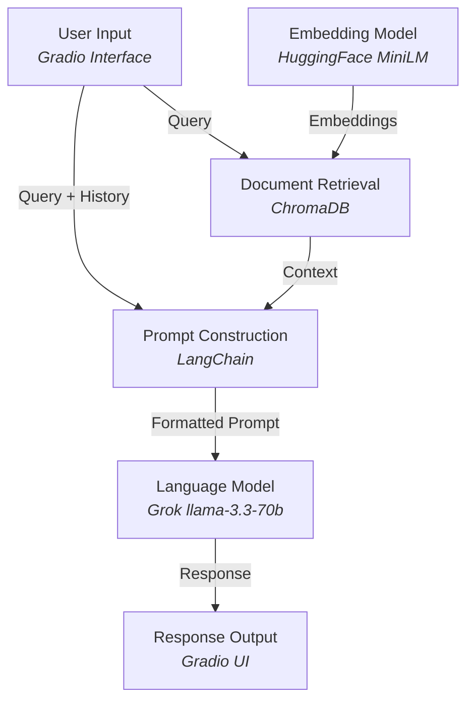

# Mental Health Chatbot 🧠🤖

  
*Empowering well-being, one conversation at a time.*

Welcome to the **Mental Health Chatbot**, a compassionate AI-powered assistant designed to provide emotional support and a listening ear. Built with cutting-edge technologies like LangChain, Groq API, and ChromaDB, this project aims to offer thoughtful, empathetic responses to users while leveraging a knowledge base of mental health resources. Whether you're feeling down or just need someone to talk to, this chatbot is here to help—though for serious concerns, we always recommend reaching out to a licensed professional.

This project was developed as part of an effort to blend AI with mental health support, showcasing how technology can be a force for good. Hosted on Gradio for an interactive experience, it’s ready to assist and easy to deploy!

---

## 🌟 Features

- **Empathetic Responses**: Powered by the `llama-3.3-70b-versatile` model from Groq, delivering warm and understanding replies.
- **Contextual Awareness**: Uses a vector database (ChromaDB) to retrieve relevant information from uploaded mental health PDFs.
- **Interactive UI**: Built with Gradio for a sleek, user-friendly chat interface.
- **Scalable Knowledge Base**: Load and process PDF documents to expand the chatbot’s understanding of mental health topics.
- **Privacy-Focused**: Runs locally or on a hosted instance—no external data sharing required.

---

## 🛠️ Tech Stack

- **LangChain**: For managing conversational AI workflows and document retrieval.
- **Groq (API)**: The bacbone LLM of llama-3.3-70b-versatile for Prompt and Accurate Response to Match Emotional Quotient of People.
- **ChromaDB**: A vector database for storing and retrieving document embeddings.
- **HuggingFace Embeddings**: `sentence-transformers/all-MiniLM-L6-v2` for text embeddings.
- **PyPDF & Text Splitting**: To process and chunk PDF documents for efficient retrieval.
- **Gradio**: For the interactive web interface.
- **Python**: The core programming language driving the project.

---

## 🚀 Getting Started

### Prerequisites
- Python 3.11+
- pip for package management
- A Groq API key (get yours [here](https://console.groq.com/keys))

### Installation

1. **Clone the Repository**
   ```bash
   git clone https://github.com/Say2hub/Mental_health_chatbot.git
   cd Mental_Health_Chatbot
   ```

2. **Install Dependencies**
   ```bash
   pip install -r requirements.txt
   ```

   *Note*: The full list of dependencies includes:
   - `langchain_groq`
   - `langchain_community`
   - `langchain_chroma`
   - `sentence_transformers`
   - `pypdf`
   - `gradio`
   - `torch`
   - `transformers`

3. **Set Up Your Groq API Key**
   Replace the placeholder in the code with your Groq API key:
   ```python
   groq_api_key = "your-api-key-here"
   ```

4. **Prepare Your Knowledge Base**
   - Place mental health-related PDF files in the `/content/sample_data/` directory.
   - The chatbot will process these PDFs to build its vector database.

5. **Run the Chatbot**
   ```bash
   python chatbot.py
   ```
   Open the Gradio URL (e.g., `http://127.0.0.1:7860`) in your browser to start chatting!

---

## 📂 Project Structure

```
mental-health-chatbot/
├── chatbot.py          # Main script for the chatbot
├── chroma_db/          # Persisted vector database directory
├── sample_data/        # Directory for PDF documents
├── requirements.txt    # List of Python dependencies
└── README.md           # You’re reading it!
```
## Project_Architecture Overview

---

## 🎯 How It Works

1. **Document Processing**: PDFs are loaded, split into chunks, and embedded using HuggingFace’s `all-MiniLM-L6-v2` model.
2. **Vector Storage**: Embeddings are stored in ChromaDB for fast retrieval.
3. **Query Handling**: User inputs are matched against the vector database to fetch relevant context.
4. **Response Generation**: The Groq LLM crafts empathetic responses based on the context and chat history.
5. **UI Interaction**: Gradio provides a clean, real-time chat interface.

---

## 📸 Demo

### Screenshots
Here’s what the Mental Health Chatbot looks like in action:

  
*The Gradio interface where users interact with the chatbot.*

 
 
*An example of the chatbot providing an empathetic response.*

### Video Demonstration
Watch the chatbot in action:

  
*A short demo showing the chatbot responding to user input.*

## ⚙️ Customization

- **Prompt Tuning**: Modify the `prompt_template` in the code to adjust the chatbot’s tone or focus.
- **Model Swap**: Experiment with other LLMs supported by LangChain/Groq.
- **Knowledge Base**: Add more PDFs or text files to enrich the chatbot’s knowledge.

---

## 🌍 Deployment

For a public-facing version:
1. Run locally with `app.launch(debug=True)` for testing.
2. Deploy to **Hugging Face Spaces** for free hosting:
   ```bash
   gradio deploy
   ```
   Follow the prompts to upload to your HF Space!

---

## ⚠️ Disclaimer

This chatbot is designed for general emotional support and is not a substitute for professional mental health care. For urgent or serious concerns, please contact a licensed therapist or crisis hotline.

---

## 🤝 Contributing

We’d love your help to make this project even better!  
- Fork the repo.
- Submit a pull request with your enhancements.
- Open an issue for bugs or feature suggestions.

---

## 📜 License

This project is licensed under the MIT License—see the [LICENSE](LICENSE) file for details.

---

## 🙏 Acknowledgments

- **Groq**: For Providing Backend Support to llm Calls.
- **LangChain**: For simplifying conversational AI development.
- **Gradio**: For making UI creation a breeze.
- **HuggingFace**: For powerful embedding models.

---

*“Sometimes, all we need is someone—or something—to listen.”*  
Let’s make mental health support more accessible, together. 💙

---
